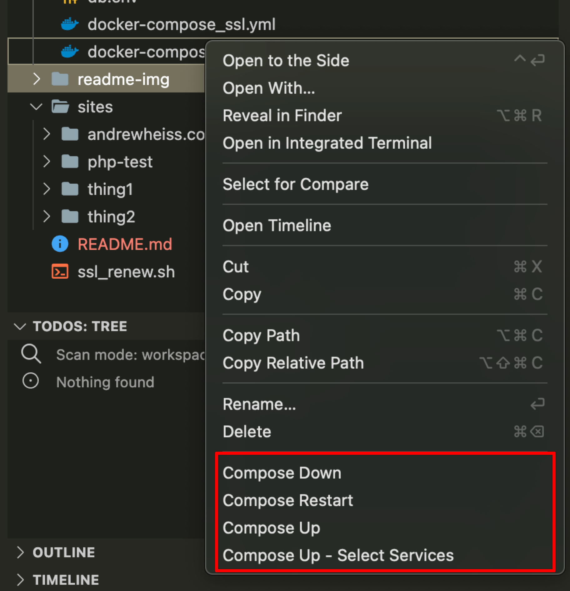
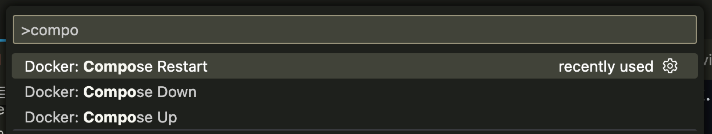
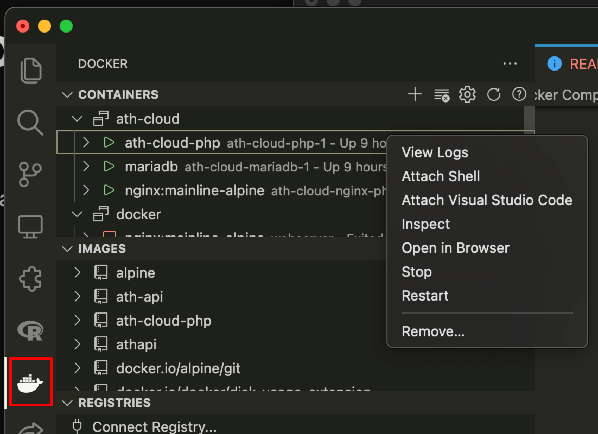

# Containerized nginx server with Docker Compose

This might seem wild and complicated but it's surprisingly straightforward! This uses Docker Compose to create an nginx + PHP + MySQL stack (but the PHP/MySQL stuff is optional—I'm currently not actually using it yet in my production server; just nginx)

This repository has two folders: `sites/` and `docker/` (they can really be named whatever)

Here's the tl;dr situation:

- Static site folders live in `/sites`
- The server itself runs from `/docker` and is orchestrated through Docker Compose
- This whole setup can run locally from your own computer for development purposes, or it can run on a real life server like a Digital Ocean droplet.
  - Locally, it uses self-signed certificates named to look like Let's Encrypt certificates so that you can visit `https://your-site.localhost`
  - Remotely, it uses a Let's Encrypt certbot container to get a real SSL certificate. A separate script (`ssl_renew.sh`) runs periodically with cron to check if the certificate needs to be renewed.


## Server details

This all runs on a minimally configured Digital Ocean droplet. I could probably use something like Ansible to automate the server setup, but why.

I used these guides to set it up:

- [Initial server setup](https://www.digitalocean.com/community/tutorials/initial-server-setup-with-ubuntu-22-04) for setting up SSH, correct user groups, firewall, etc.
- [Installing Docker](https://www.digitalocean.com/community/tutorials/how-to-install-and-use-docker-on-ubuntu-22-04) for installing, um, Docker
- [Installing Docker Compose](https://www.digitalocean.com/community/tutorials/how-to-install-and-use-docker-compose-on-ubuntu-22-04) for installing Docker Compose


## Website files in `sites/`

This is mostly designed to serve static sites generated with Quarto, bookdown + Hugo, pelican, jekyll, and so on. All these sites live in `sites/`. I upload them to my Digital Ocean server from my computer using rsync. In my local `~/.ssh/config` file, I have an entry like this:

```
Host ath-cloud
   HostName IP_ADDRESS_GOES_HERE
   User andrew
```

That way I can run `ssh ath-cloud` and connect to the server from my terminal. It also lets me make clean deploy scripts, [like this](https://github.com/andrewheiss/evalsp24.classes.andrewheiss.com/blob/main/deploy.sh):

```sh
REMOTE_HOST="ath-cloud"
REMOTE_DIR="~/sites/site_name/public"
REMOTE_DEST=$REMOTE_HOST:$REMOTE_DIR

echo "Uploading new changes to remote server..."
echo
rsync -crvP --delete _site/ $REMOTE_DEST
```

## Server files in `docker/`

The `docker/` folder contains everything necessary for a complete nginx + Let's Encrypt + PHP + MySQL server.

### Containers

There are three containers defined in `docker/docker-compose.yml`:

1. **nginx** for serving websites. It mounts the local `sites/` folder internally as `/var/www/html/`, so anything that gets put in `sites/` on the Digital Ocean server (or locally if running locally) will automatically be seen by the containerized server. Magic.

   All the nginx configuration files live in `docker/nginx-config`. There are a billion different ways to deal with this configuration stuff. In this case, I ended up using h5bp (the old [HTML5 Boilerplate](https://html5boilerplate.com/) people)'s [Nginx Server Configs](https://github.com/h5bp/server-configs-nginx) system, since it's a nice and well-supported way of modularly configuring a server. But it doesn't have to be this complicated. All that matters is that you map configuration files into the container at `/etc/nginx` so that the container can see them.

   Each individual static site that I want to set up is configured with a single .conf file in `docker/nginx-conf/conf.d`. When I want to add a new site, I duplicate one of those and change the server name and the root directory.

    To restart the nginx server so that it reads the new configuration file, you can either run `docker compose down && docker compose up` to shut down the whole stack and restart it (brute force, but easy to do if you're using Visual Studio Code and its Docker Compose support), or you can run this at the terminal to send a restart command to the server container:

    ```sh
    docker compose -f docker/docker-compose.yml exec nginx-php nginx -s reload
    ```

2. **php** for doing PHP things. It uses a separate Dockerfile (`docker/dockerfiles/php.dockerfile`) that also installs Image Magick and database stuff.

3. **mariadb** for doing database things. It mounts the local `docker/db` folder so that all the container's database files are stored on the server itself, making it so the database is persistent across container restarts. It also uses the environment variables in `docker/db.env` to set up user names and passwords and stuff.

You can add any other containers you want here too, like [a {plumber} server](https://github.com/andrewheiss/docker-plumber-nginx-letsencrypt) for [R-based APIs](https://www.andrewheiss.com/blog/2024/01/12/diy-api-plumber-quarto-ojs/), Node, React, or whatever. No mucking around with compiling stuff on Digital Ocean—if it can live in Docker container, you can run it here. Magic again.

### Easier approach to working with Docker Compose

Visual Studio Code has [incredible support for Docker and Docker Compose](https://code.visualstudio.com/docs/containers/overview). Like, I can right click on a docker-compose.yml file and tell it to start, stop, or restart:



Or I can use the command palette (⌘⇧P) and do the same thing:



And I can use the container tab to look inside the running containers:



If you use a [Visual Studio Code remote session through SSH](https://code.visualstudio.com/docs/remote/remote-overview), you can do the same things on the remote server. This is super neat because it's really hard to see what's happening in remote Docker containers. Locally, you can use the Docker Dashboard GUI (or Visual Studioe Code) to see what's running, view logs, run commands inside containers, and so on. With Visual Studio Code, you can do similar things with the remote containers.


### Ports and server names

Docker Compose is currently mapping the host computer's ports 80 and 443 to the internal ports 80 and 443, but you can change that for development purposes so that you can access stuff at `http://localhost:8080/` and `https://localhost:8443` (or whatever), like this:

```yaml
  ports:
      - 8080:80
      - 8443:443
```

But also, thanks to how localhost works and how nginx's `server_name` option works, you can set options like this in the server settings:

```
server_name thing1.localhost
```

…and then you can access it locally at `http://thing1.localhost`. You don't even need to edit `/etc/hosts` on your computer or anything—it Just Works™.

So rather than mess with ports, I just use 80 and 443 and use server names locally (and in production).

### SSL in development

I want to be able to run this Docker Compose stuff locally and have it mirror real life as much as possible, so I had to make a way to run HTTPS. Let's Encrypt [doesn't work with localhost](https://letsencrypt.org/docs/certificates-for-localhost/), so I followed their advice and generated certificates that look just like the ones you get from Let's Encrypt:

```sh
openssl req -x509 -out live/andrewheiss.com/fullchain.pem -keyout live/andrewheiss.com/privkey.pem \
  -days 365 -newkey rsa:2048 -nodes -sha256 \
  -subj '/CN=localhost' -extensions EXT -config <( \
   printf "[dn]\nCN=localhost\n[req]\ndistinguished_name = dn\n[EXT]\nsubjectAltName=DNS:localhost\nkeyUsage=digitalSignature\nextendedKeyUsage=serverAuth")
```

Those are stored in `docker/ssl-dev`. In `docker/docker-compose.yml`, I use a volume setting to map `docker/ssl-dev` locally to `/etc/letsencrypt` inside the nginx container:

```yaml
  volumes:
      - "./ssl-dev/:/etc/letsencrypt/:ro"
```

…so nginx thinks that they're regular real Let's Encrypt certificates. That means I can use them in server configuration files like this:

```
ssl_certificate /etc/letsencrypt/live/andrewheiss.com/fullchain.pem;
ssl_certificate_key /etc/letsencrypt/live/andrewheiss.com/privkey.pem;
```

… and they'll work.

In production, I change the mapping so that `docker/letsencrypt` is mapped to `/etc/letsencrypt` inside the nginx container so that it uses the real certificates that the certbot container gets:

```yaml
  volumes:
      - "./letsencrypt/:/etc/letsencrypt/:ro"
```

### SSL in production

This setup provides SSL through Let's Encrypt. Let's Encrypt has a [Docker container](https://eff-certbot.readthedocs.io/en/stable/install.html) for [certbot](https://certbot.eff.org/), its automated certificate getting-and-renewing program, but it doesn't have to run all the time (actually it only needs to run once to get the initial certificates), so I actually use it in a separate Docker Compose file in `docker/docker-compose_ssl.yml`.

To get the initial certificates, I run this from the terminal on the remote machine (actually technically I right clicked on the `docker/docker-compose_ssl.yml` file in a remote Visual Studio Code session and told it to run that way):

```sh
docker compose -f docker/docker-compose_ssl.yml up certbot-andrewheiss
```

That does whatever certbot needs to get certificates. I have it set up to use a Digital Ocean API key stored in `~/secrets/certbot/dnsdigitalocean.ini` on my server so it can do whatever DNS-based magic certbot needs to do for wildcard certificates (i.e. certificates for *.andrewheiss.com).

Renewing certificates from Docker Compose is a little tricky because certbot would need to tell the nginx server to restart after successful renewal and containers can't really talk to each other like that, so I instead use cron on my server. I have this script named `ssl_renew.sh`:

```sh
#!/bin/sh

# Renew certificates
docker compose -f /path/to/docker-compose_ssl.yml up certbot-renew

# Reload nginx
docker compose -f /path/to/docker-compose.yml exec nginx-php nginx -s reload
```

I ran `crontab -e` and added this to it:

```
37 3 * * * /path/to/renew_ssl.sh
```

That makes it so that it'll try to renew certificates every night at 3:37 AM. This also means that nginx gets restarted every day, which might be excessive, but I'm a small server with small websites, so whatever.

## Copying files from my old server to my new server

All my older static sites lived on an older Digital Ocean droplet that I created in 2014ish. Newer droplets support internal networking, so they can talk to each other and so you can easily transfer files between them. But mine was too old to support that.

So I set up [passwordless authentication](https://www.strongdm.com/blog/ssh-passwordless-login) so that I could connect to my new server from my old server through SSH. I then ran rsync a bunch of times to copy each individual site from the old server to the new `~/sites` folder on the new server, while maintaining all the timestamps and other metadata:

```sh
# I ran this from my old server
rsync -avz /home/andrew/sites/datavizf23.classes/ andrew@IP_ADDRESS_OF_NEW_SERVER:/home/andrew/sites/datavizf23.classes
```

I repeated that, changing the folder names as needed. I could have automated it, I guess, but whatever.


## Helpful resources

I opened a billion browser tabs to get this all working and found several helpful resources. I'm just going to dump them here for future reference.

- https://www.digitalocean.com/community/tutorials/how-to-secure-a-containerized-node-js-application-with-nginx-let-s-encrypt-and-docker-compose
- https://mikesbytes.org/web/2020/02/29/docker-nginx-letsencrypt.html
- https://blog.jarrousse.org/2022/04/09/an-elegant-way-to-use-docker-compose-to-obtain-and-renew-a-lets-encrypt-ssl-certificate-with-certbot-and-configure-the-nginx-service-to-use-it/
- https://pentacent.medium.com/nginx-and-lets-encrypt-with-docker-in-less-than-5-minutes-b4b8a60d3a71
- https://blog.jonsdocs.org.uk/2023/04/08/using-docker-for-a-php-mariadb-and-nginx-project/
- https://www.programonaut.com/setup-ssl-with-docker-nginx-and-lets-encrypt/
